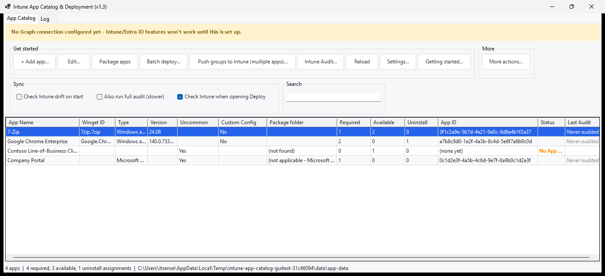
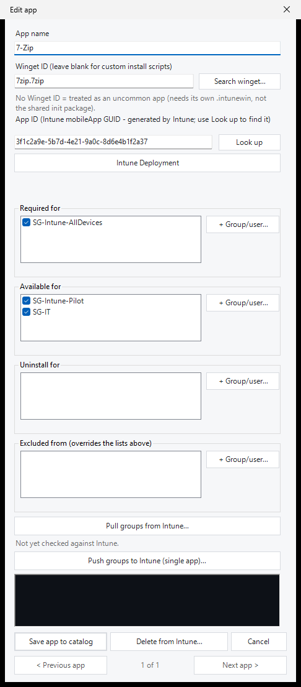
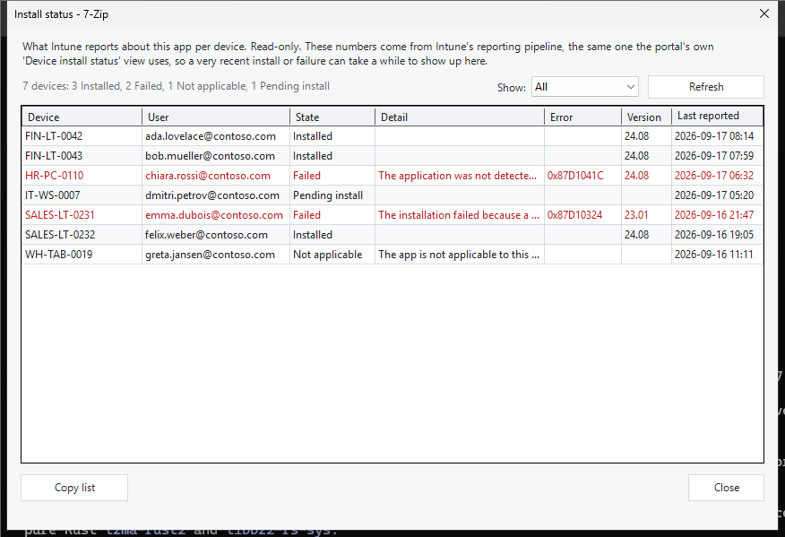
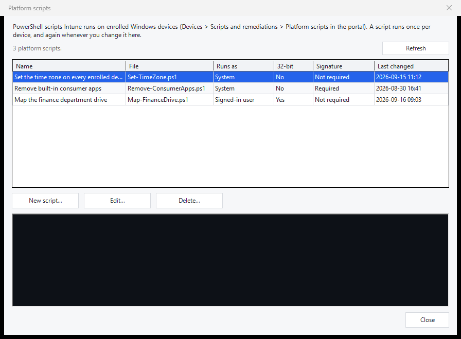

# Intune App Catalog & Deployment

A Windows desktop app (PowerShell + WinForms, no install) for keeping a
**catalog of Win32 apps as files**, packaging them, and deploying and
assigning them in Microsoft Intune - without clicking through the portal
for every app, and without losing track of what an app is *supposed* to
look like.

The catalog is one JSON file per app in a folder you choose, so it can live
in git next to everything else you version.



## What it does

**Catalog**
- One file per app: name, Winget ID, App ID, groups, and the full Intune
  metadata (install/uninstall commands, detection rule, requirements,
  return codes, dependencies).
- Winget apps get their install command, uninstall command and detection
  rule generated, so a new app is usually just a name and a Winget ID.
- Backups on every save, and a check that two apps can never overwrite each
  other's file.

**Intune**
- Deploy a single app or a batch, update metadata, replace package content.
- Assign groups per app - Required, Available, Uninstall, plus **Excluded
  from**, with a preview of exactly what will change before anything is
  pushed.
- Pull metadata and groups back from Intune, and an audit that lists every
  app whose live settings have drifted from the catalog.
- Installation status per app: which devices and users have it, and which
  failed with what error.
- Platform scripts: list, add, change, delete the PowerShell scripts Intune
  runs on enrolled devices, with their run status per device.
- Delete from Intune, single or bulk, with the app's dependencies handled.

**Entra ID**
- Create, rename and delete groups, manage their members, and check that
  every group the catalog references still exists.

**Everything it sends**
- Lines starting with `[GRAPH]` in the log show every change sent to
  Microsoft Graph, a summary of the reads, and every failure with Graph's
  request-id. `[RUN]` lines show the winget and packaging commands.
- Tokens, headers and request bodies are never logged.

One app, as the catalog stores it - name, Winget ID, App ID, and the groups
it's required for, available to, uninstalled from, and excluded from:



Who actually has an app, and which devices failed:



The platform scripts Intune runs on enrolled devices:



## Requirements

- Windows 10/11 with **PowerShell 7** or **Windows PowerShell 5.1** (both
  are supported and tested).
- The **Microsoft.Graph.Authentication** module - the app offers to install
  it for you (More actions... > Verify > Prerequisites...).
- **winget** (the "App Installer" package) for the Winget features.
- An **Entra ID app registration** with a certificate, for app-only
  sign-in. Settings... > First time? Setup guide... walks through it.
- **IntuneWinAppUtil.exe** is downloaded automatically when packaging.

## Getting started

1. Download the release zip (or clone this repo) and unblock it if Windows
   marked it as downloaded.
2. Run `IntuneDeployment.ps1` - double-click it, or:
   ```powershell
   pwsh -ExecutionPolicy Bypass -File .\IntuneDeployment.ps1
   ```
3. Open **Settings...** and fill in Tenant ID, Client ID and certificate,
   then **Test connection** and **Save**. The setup guide in that window
   lists the Graph permissions the app registration needs.
4. Use **Open other folder...** to point the catalog at your own folder, or
   start adding apps in the one that ships with it.

## Permissions the app registration needs

Application permissions, with admin consent:

| Permission | For |
| --- | --- |
| `DeviceManagementApps.ReadWrite.All` | Apps: deploy, update, assign, delete, install status |
| `Group.ReadWrite.All` | Creating and managing the groups apps are assigned to |
| `User.Read.All`, `Device.Read.All`, `Directory.Read.All` | Resolving users, devices and groups by name |
| `DeviceManagementScripts.ReadWrite.All` | Platform scripts only |

When Graph refuses a request, the app says which of these is likely
missing.

## Documentation

- [CHANGELOG.md](CHANGELOG.md) - what changed per version.
- [docs/tenant-test-checklist.md](docs/tenant-test-checklist.md) - a pass
  through a **test tenant** for the parts that can only be verified live.
- [code/tests/README.md](code/tests/README.md) - the test suites, what they
  cover and, just as importantly, what they don't.

## Tests

```powershell
pwsh -NoProfile -File code/tests/CatalogLogic.Tests.ps1        # pure logic, runs anywhere
pwsh -NoProfile -File code/tests/gui/DialogSmoke.GuiTests.ps1  # drives the real app (Windows)
```

Every push runs the unit tests on Linux, PowerShell 7 and Windows
PowerShell 5.1, plus the GUI suites on Windows, under both PowerShells.

## License

Copyright (C) 2026 Viktor Ljuca <https://monsama.ch>

This program is free software: you can redistribute it and/or modify it
under the terms of the **GNU General Public License version 2**, or (at
your option) any later version - `SPDX-License-Identifier:
GPL-2.0-or-later`. It is distributed in the hope that it will be useful,
but WITHOUT ANY WARRANTY; without even the implied warranty of
MERCHANTABILITY or FITNESS FOR A PARTICULAR PURPOSE. See
[LICENSE](LICENSE) for the full text.

It talks to Microsoft Intune and Microsoft Entra ID through the Microsoft
Graph API and uses the `Microsoft.Graph.Authentication` PowerShell module,
which is Microsoft's own and carries its own license. IntuneWinAppUtil.exe
(downloaded on demand when packaging) is Microsoft's Win32 Content Prep
Tool, under its own license.

## What it is not

Not a general Intune console. It handles apps, their groups and platform
scripts; compliance policies, configuration profiles, device actions and
enrollment stay in the portal. It signs in as one app registration, so
Intune's audit log shows the app, not the person at the keyboard.
